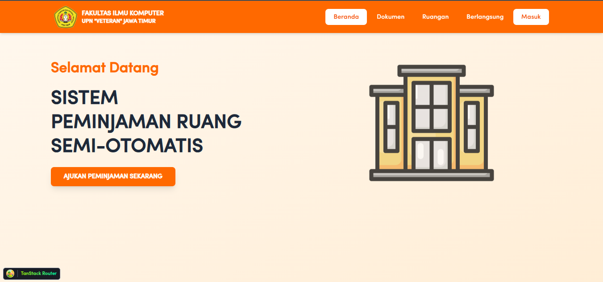

<p align="right">✨ Final Project Manajemen Proyek Informatika ✨</p>
<h1 align="center">SISTEM PEMINJAMAN RUANGAN </h1>
<p align="center">
<strong>Sistem Peminjaman Ruangan Terintegrasi</strong>
</p>

---

## 🖼️ Preview

> Preview akan menampilkan **Landing Page Sistem Peminjaman Ruangan**



---

## 👥 Team

| Name | Role |
|------|------|
| **I Gusti Ngurah Karunya P.** | Project Lead |
| **Dhea Intan Sagita** | System Analyst & UI/UX Designer |
| **Muizzul Rizqon Gunawan** | Machine Learning Developer |
| **Naila Jinan Gaisani** | Fullstack Web Developer |

---

## 🎯 Project Goals

SIPRESMARU dikembangkan untuk **mengatasi proses peminjaman ruangan yang masih manual, tidak terpusat, dan rawan kesalahan administratif**.  
Sistem ini bertujuan untuk:

- Menyediakan **platform terpusat** untuk peminjaman ruangan
- Mempermudah pengguna dalam mengajukan peminjaman secara digital
- Membantu pengelola dalam **verifikasi dokumen secara otomatis**
- Mengurangi kesalahan manusia melalui **verifikasi berbasis Machine Learning**
- Meningkatkan transparansi, efisiensi, dan akuntabilitas peminjaman ruangan

Sistem ini cocok diterapkan pada **institusi pendidikan, organisasi, dan instansi pemerintahan**.

---

## ✨ Key Features

### 1. Manajemen Ruangan
- Daftar ruangan lengkap dengan kapasitas dan deskripsi
- Informasi ketersediaan ruangan secara terpusat

### 2. Manajemen Fasilitas
- Setiap ruangan memiliki daftar fasilitas
- Memudahkan pengguna memilih ruangan sesuai kebutuhan

### 3. Peminjaman Ruangan
- Pengajuan peminjaman berbasis web
- Penentuan tanggal dan durasi peminjaman
- Riwayat peminjaman pengguna

### 4. Dokumen & Template
- Template dokumen peminjaman
- Upload dokumen pendukung (PDF / gambar)

### 5. Verifikasi Berkas Berbasis Machine Learning
- Deteksi keberadaan **tanda tangan dan stempel**
- Membantu admin memverifikasi keabsahan dokumen
- Mengurangi proses verifikasi manual

### 6. Manajemen Pengguna & Role
- Role pengguna (User & Admin)
- Hak akses berbeda sesuai peran

---

## 🚩 Minimum Viable Product (MVP)

| Feature | Status |
|-------|--------|
| Website dapat diakses | ✅ |
| Pengajuan peminjaman ruangan | ✅ |
| Manajemen data ruangan | ✅ |
| Upload dokumen peminjaman | ✅ |
| Verifikasi dokumen (ML) | ✅ |
| Role User & Admin | ✅ |
| API terintegrasi Frontend–Backend | ✅ |
| Database relasional | ✅ |

---

## 🎨 Design & Documentation

- **Figma UI/UX**  
  https://www.figma.com/design/K105USbI26D4qunnB5Uqhn/Untitled--Copy-?node-id=0-1&t=p9ZTWhvrL4Tn9Hk8-1

- **Database Diagram (DBDiagram)**  
  https://dbdiagram.io/d/sistem-6926c432a0c4ebcc2bc78cd4

- **Postman API Documentation**  
  https://web.postman.co/workspace/My-Workspace~926feaf2-7d2a-4c03-8a8c-41234f036506/collection/38236284-afa68e1f-4bf1-432f-a0f9-480efbb8b049?action=share&source=copy-link&creator=38236284

---

## 💻 Technology Stack

### Frontend
- React 19
- Vite
- Tailwind CSS
- Redux Toolkit
- TanStack Router & Query
- Axios
- Framer Motion

### Backend
- Node.js
- Express.js
- Prisma ORM
- PostgreSQL / MySQL
- Zod Validation
- JWT Authentication
- Multer (File Upload)

### Machine Learning
- Python
- Model deteksi tanda tangan & stempel pada dokumen

---

## ⚙️ Installation & Setup

### 1️⃣ Clone Repository
```bash
git clone https://github.com/nellnelaa/Sistem-Peminjaman-Ruangan.git
cd Sistem-Peminjaman-Ruangan
```

## ⚙️ Installation & Setup

### 2️⃣ Backend Setup

```bash
cd backend
npm install
```
Buat file .env pada folder backend:
```bash
DATABASE_URL=your_database_url
JWT_SECRET=your_secret_key
PORT=3000
```
Generate Prisma Client dan migrate database:
```bash
npm run prisma:generate
npm run prisma:refresh
```
Jalankan backend server:
```bash
npm run dev
```

### 2️⃣ Frontend Setup
```bash
cd frontend
npm install
npm run dev
```

## 📚 How to Use
### 6. Manajemen Pengguna & Role
- Role pengguna (User & Admin)
- Hak akses berbeda sesuai peran

### 1. Login / Register
Pengguna melakukan login atau registrasi untuk mengakses sistem.

### 2. Ajukan Peminjaman Ruangan
- Pilih ruangan yang tersedia
- Tentukan tanggal dan durasi peminjaman
- Upload dokumen pendukung peminjaman

### 3. Verifikasi Dokumen
- Sistem melakukan deteksi tanda tangan dan stempel menggunakan Machine Learning
- Admin melakukan validasi akhir terhadap pengajuan

### 4. Monitoring Peminjaman
- Cek status pengajuan peminjaman
- Lihat riwayat peminjaman ruangan


## ©️ Credits

Proyek ini dikembangkan sebagai Final Project Mata Kuliah Manajemen Proyek Informatika
Universitas Pembangunan Nasional “Veteran” Jawa Timur

Dosen Pengampu:
Bu Afina Lina Nurlaili, S.Kom., M.Kom
